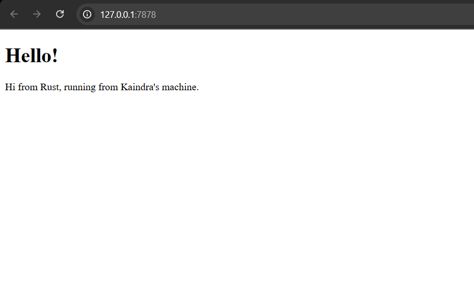

# Module 6: Concurrency

### Kaindra Rizq Sachio
### 2306274964   
### CSCM602223 - Pemrograman Lanjut

---

## Milestone 1: Single threaded web server

`handle_connection(mut stream: TcpStream)`

Method ini memproses request dari klien yang terhubung melalui TCP

TCP (Transmission Control Protocol) adalah protokol komuniksi yang digunakan untuk mengirimkan data antar perangkat dalam jaringan.

Method ini menerima objek dengan tipe data `TcpStream`, yakni tipe data yang merepresentasikan satu konteksi TCP. Selain itu, objek yang diterima juga bersifat mutable

Penjelasan lines:

- `let buf_reader = BufReader::new(&mut stream);`: Kode ini men-wrap `stream` dalam buffered reader agar proses read lebih efisien
- ` let http_request: Vec<_> = buf_reader
        .lines()
        .map(|result| result.unwrap())
        .take_while(|line| !line.is_empty())
        .collect();`: Kode ini mengambil request header
- `.lines()`: Membaca  `stream` line by line
- `.map(|result| result.unwrap())`: Mengambil nilai string dari setiap `Result<String, io::Error>`. Panic jika terjadi error
- `.take_while(|line| !line.is_empty())`: Read sampai ketemu line kosong (menandakan akhir HTTP)
- `collect` Mengubah lines menjadi `Vec<String>`
- `println!("Request: {:#?}", http_request);`: Mencetak HTTP request yang sudah diproses

`main()`

Method ini memulai server TCP yang mendengarkan koneksi pada port 7878, lalu memproses setiap koneksi masuk menggunakan `handle_connection`

Penjelasan lines:
- `let listener = TcpListener::bind("127.0.0.1:7878").unwrap();`: Membuat TCP Listener di alamat 127.0.0.1:7878 (localhost, port 7878).. Jika gagal (misalnya, port 7878 sudah digunakan oleh program lain), program akan panic dan berhenti (dari `.unwrap()`).

- `for stream in listener.incoming() {
    let stream = stream.unwrap();
    handle_connection(stream);
}`: Loop untuk menerima koneksi dari klien dan memprosesnya.

- `listener.incoming()`: Mendapatkan iterator untuk setiap koneksi yang masuk.

- `stream.unwrap()`: Mengambil TcpStream dari Result<TcpStream, Error>, panic jika gagal.

- `handle_connection(stream);`: Memproses koneksi klien dengan fungsi handle_connection().

## Milestone 2: Returning HTML

Perubahan utama kode adalah sekarang server dapat mengirimkan response HTTP kepada client. Sebelumnya kode hanya membaca dan mencetak request HTTP di terminal. Sekarang, server dapat mengembalikan response yang berisi status HTTP, header, dan isi file hello.html.

Kode menggunakan library `std::fs` untuk membaca file. Setelah itu, kode menggunakan `fs::read_to_string("hello.html").unwrap()` untuk membaca file `hello.html`. 

 Kode kemudian menulis respon HTTP dalam variabel `response`. Setelah itu, `    stream.write_all(response.as_bytes()).unwrap();` akan mengirimkan response kepada client melalui koneksi TCP.

